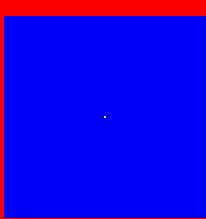

# Spatialized-Prisoners-Dilemma-model
A spatialisation of the famous game theory "Prisoners Dilemma" model. 
Here, each cell (of a Cellular Automata) stands for a player in the famous game theory "Prisoners Dilemma" context. 
The payoff for the different configurations are such that from an individualist point of view, its better to defect (whatever the strategy of the opponent, the best individual payoff corresponds to the "defect" strategy), whereas from a collective point of view, its better to cooperate (the sum of the two individual payoffs is maximal for the configuration "cooperate" vs "cooperate").

The payoffs matrix is the following:

              Cooperation	  Defection
Cooperation	    100 / 100	    0 / 185

Defection	      185 / 0	      0 / 0

With a Moore neighbourgood (8), the boundaries are "periodic" (toroidal spatial grid). At each time-step, the strategy of the players being set, each player perform 9 games: with its 8 neighbours and also with itself. The total payoff is then compared to the total payoffs of the 8 neighbours players If one of them is higher than the personal one, then the corresponding strategy will be adopted for the next time-step. In such a context, at the global level, does one of the two strategies invade the other ???... The movie displayed here shows the intrusion of one defector in a world of cooperators... The grid size is 101x101 and the defector is initially located in the middle of the grid. The stable defectors appear in red, or yellow for previous cooperators just turning into defectors. The stable cooperators appear in blue, or in green for previous defectors just turning into cooperators.

  
For more details about this cellular automata, look at the following paper: Nowak, M.A. and May, R.M. 1992. Evolutionary games and spatial chaos. Nature, 359: 826-829.
